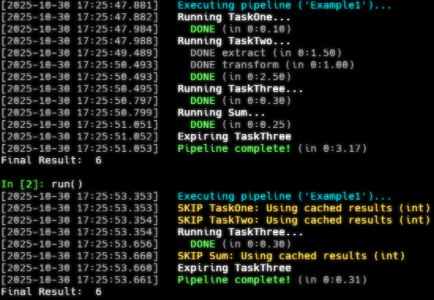

# Little Pipelines - A Lightweight Task Pipeline Framework

Little Pipelines is a Python library for building and executing data pipelines with intelligent execution, results caching, and dependency management. It provides a simple approach to orchestrating tasks while maintaining minimal dependencies and complexity.  

This library is intended for individual analysts or small teams who need simple, cacheable data pipelines without the complexity of enterprise workflow orchestration tools (e.g., Luigi, Airflow, Prefect, dbt, etc.) or cloud-based ETL platforms (e.g., Dagster, AWS Step Functions, etc.).  

Free and Open Source under the [MIT License](https://mit-license.org/), and built with the love and support of the [Missoula Urban Transporation District](https://mountainline.com/about/).  

## Key Features

- **Automatic dependency resolution** - Declare dependencies by name and let the pipeline handle execution order
- **Declarative task/process definitions** - Define Pythonic Task functions without worrying about what's going on under the hood
- **Intelligent caching** - Skip task execution if cached results are still "fresh" and the task definition or inputs haven't changed
- **Flexible cache expiration** - Control when results expire (session-based, time-based, or never)
- **Built-in performance tracking** - Automatic timing for each task's execution
- **Pre-configured logging** - Per-task loggers with configurable output using `loguru`
- **Optional interactive shell** - Subclassable `Shell` class for building custom CLI tools (work-in-progress)
- **Minimal dependencies** - Only requires `diskcache`, `loguru`, and `rich`


## Some Super Simple Examples

### Example 1
```python
from time import sleep

import little_pipelines as lp

task1 = lp.Task("TaskOne")

@task1.process
def run(this):
    sleep(0.1)  # Emulate processing time
    return 1


task2 = lp.Task("TaskTwo")

@task2.process
def extract(this):
    """A sub-process"""
    sleep(1.5)  # Emulate processing time
    return 1

@task2.process
def transform(this, ext: int):
    """A sub-process"""
    sleep(1)  # Emulate processing time
    return ext + 1

@task2.process
def run(this):
    raw_data = this.extract()
    data = this.transform(raw_data)
    return data

task3 = lp.Task(
    "TaskThree",
    # LOOK: here we tell the pipeline to expire the results upon pipeline completion
    expire_results=lp.expire.on_complete("TaskThree"),
)

@task3.process
def run(this):
    sleep(.3)  # Emulate processing time
    return 3

sum_task = lp.Task(
    "Sum",
    dependencies=["TaskOne", "TaskTwo", "TaskThree"]
)

@sum_task.process
def run(this):
    sleep(.25)  # Emulate processing time
    r1 = this.pipeline.get_result("TaskOne")
    r2 = this.pipeline.get_result("TaskTwo")
    r3 = this.pipeline.get_result("TaskThree")
    return r1 + r2 + r3

def run():
    pipeline = lp.Pipeline("Example1")
    pipeline.add(task1, task2, task3, sum_task)
    pipeline.execute()

    print("Final Result: ", pipeline.get_result("Sum"))  # 6
    return


run()

```

_Console output showing initial execution and when using cached results_  
  

Notice how TaskThree was executed on the second run becauase of the `expire.on_complete()` expiry.

### Example 2
```python
import little_pipelines as lp

zero = lp.Task("Zero")


@zero.process
def run(this):  # 'run' is a required decorated function
    return ["Some", "values"]


one = lp.Task(
    name="One",
    dependencies=["Zero"]  # Task One should execute after Zero
)


@one.process
def preflight(this):  # Some optional process
    return "OK"


@one.process
def run(this):  # 'this' is a self-like reference to the Task instance
    status = this.preflight()
    
    # Get data from dependency / upstream task
    data: list[str] = this.pipeline.get_result("Zero")
    # Manipulate it
    data.extend(["more", "values", status])
    return data  # ["Some", "values", "more", "values", "OK"]


pipeline = lp.Pipeline("tests")
pipeline.add(one, zero)  # Order doesn't matter
pipeline.execute()

print(pipeline.get_result("One"))  # '["Some", "values", "more", "values", "OK"]'

```

## The Big Picture

In short, Little Pipelines lets you mix ETL operations, SQL transformations, Python data processing, API calls, and file operations in a single pipeline. First, users define `Tasks` and `add()` them to a `Pipeline`.  
Under the hood, the Pipeline coordinates Task execution using Python's `graphlib.TopologicalSorter`, and handles the caching of results using [diskcache.Cache](https://grantjenks.com/docs/diskcache/tutorial.html#cache). Tasks are automatically configured with a [loguru](https://loguru.readthedocs.io/en/stable/overview.html) file-logger which logs to `.little_pipelines/<pipeline_name>/logs` (located in your user or home directory).  

Tasks can have dependencies (require the execution of other tasks before it). Dependencies are explicitly listed by name at the initialization of Tasks. Dependency management (topological sorting) is done automatically by the Pipeline instances's `tasks` property. So you could skip the built-in `execute()` method and hack something as dead-simple as:

```python
for task in pipeline.tasks:
    task.run()
```
